# Stage-Alarm

- 프로젝트 기간: 2024.03.13 ~ 05.03
  - 1차 프로젝트 기간: 03.13 ~ 04.04
  - 2차 프로젝트 기간: 04.08 ~ 05.03
- 참여 인원: BE 4명


##  🍳Overview

<div align="center">


| 소개 영상 |
|:-----:|
| [](https://www.youtube.com/watch?v=Z9pxJ1-OkzQ&t=10s) |
|      |


> ✨오직 당신의, 당신에 의한, 당신을 위한 공연 & 장르 알림 서비스✨

`Stage-Alarm`은 당신이 좋아하는 아티스트와 장르를 구독함으로서,   
해당 소식과 공연 정보들을 메일로 알려줘 성공하는 덕후, 이른바 성덕의 활동에 집중할 수 있게 해줍니다.  
`Stage-Alarm` 서비스의 매력에 빠져보세요!

</div>


##  🚩Project

<div align="center">
  <p>💾 BACKEND</p>
    
    
    
    
    
    

  <p>🖥️ FRONTEND</p>
    
    
    
    
    
    
    
    
  <p>⚒️ ETC</p>
    
    
    
    
    
    
    
    
    
  <br>
    
    
    
    
    
  <br>
    
    
    
    
    
    
</div>

<details>
<summary><strong>기획 과정</strong></summary>


<p style="font-size: 20px">매주 평일, 오후 13:00에 간단한 회의 진행(기획 아이템 토의, 진행상황 & 특이사항 공유)</p>


---

<p style="font-size: 20px">팀 규칙</p>

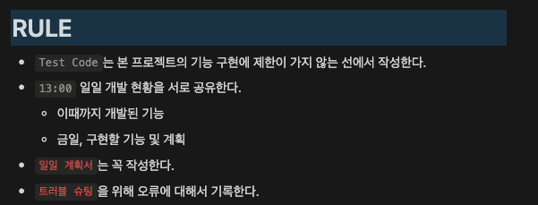

---
 
<p style="font-size: 20px">역할 분배 (출처. Google-docs)</p>

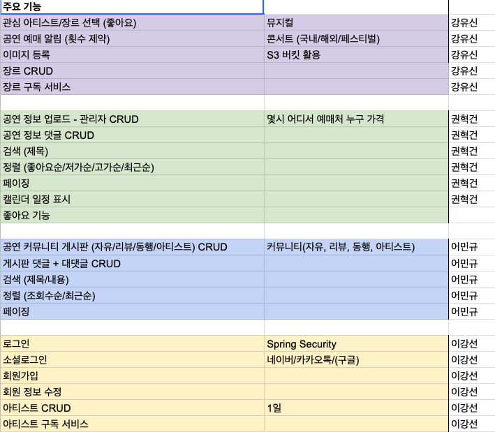  

---

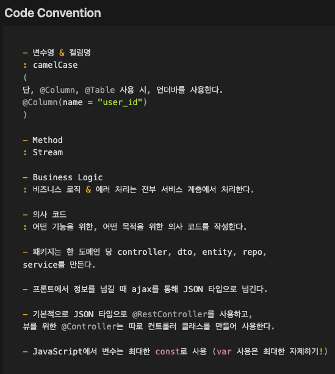

---

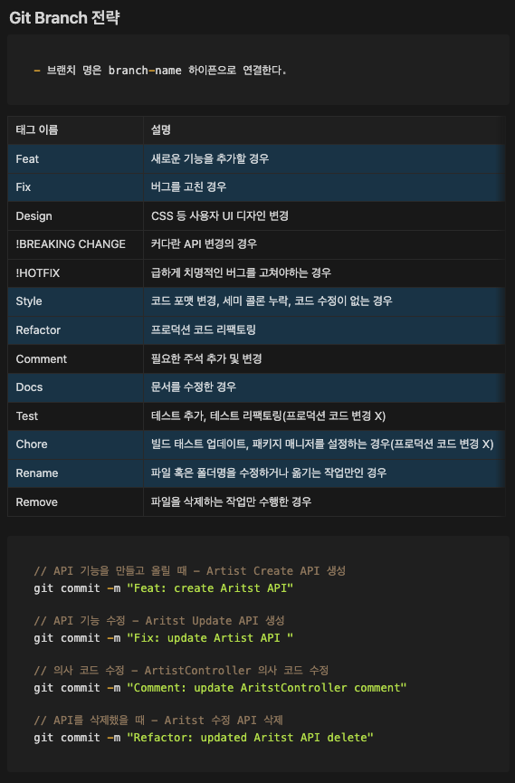

---
 
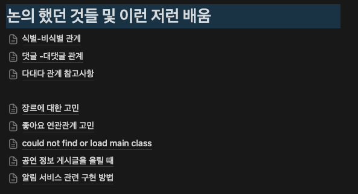

---
 
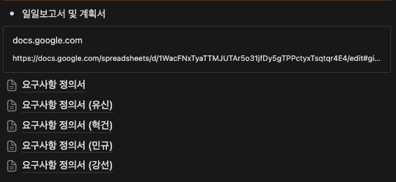
</details>

<details>
<summary><strong>아키텍처</strong></summary>

MSA 아키텍처로 구성

1. Main Server
2. Crawling Server
3. Alarm Server

- Version. A (Kubernetes 서버 환경)
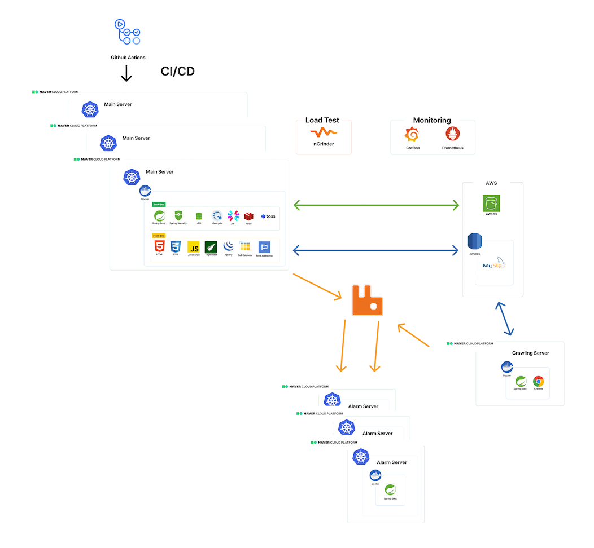

- Version. B (AWS EC2 CI/CD)
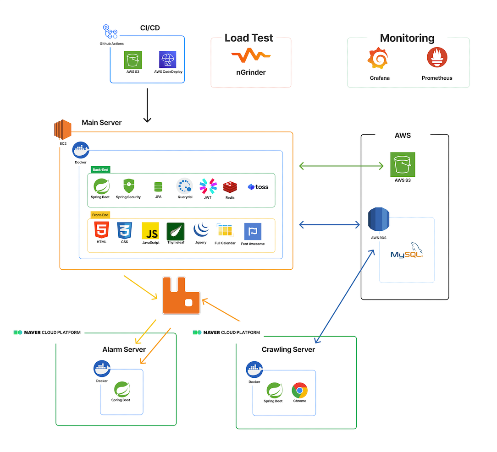
</details>

<details>
<summary><strong>ERD</strong></summary>

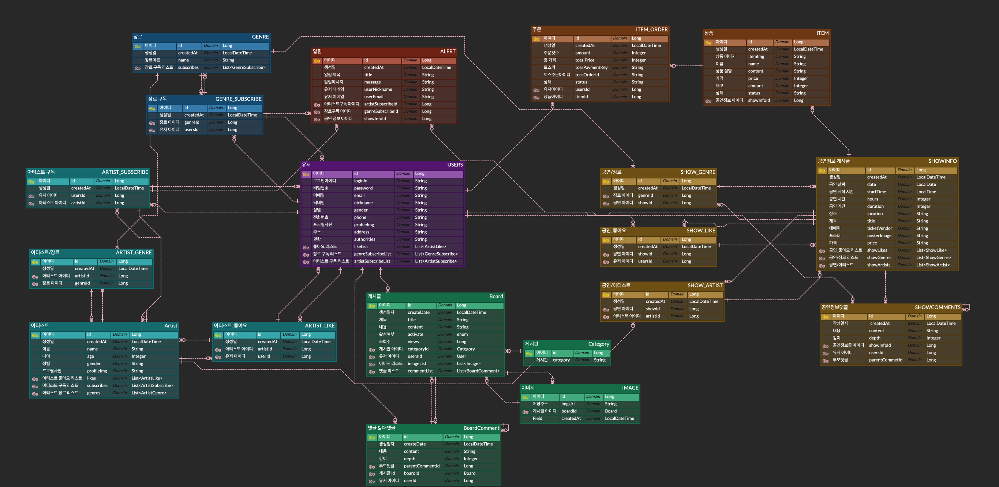
</details>

<details>
<summary><strong>API 명세서</strong></summary>

http://localhost:8080/swagger-ui/index.html


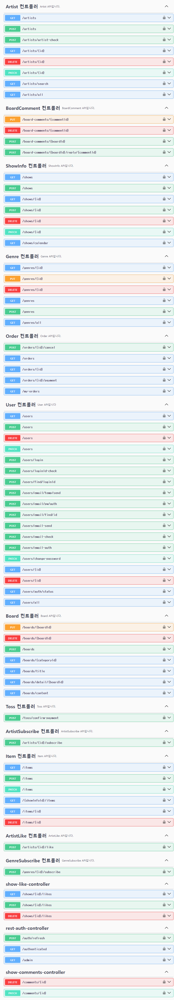
</details>

<details>
<summary><strong>nGrinder 테스트 결과</strong></summary>

<p style="font-size: 20px">결과 그래프</p>

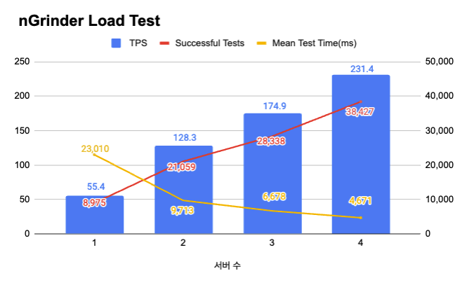

`실험 조건`  
Vusers: 3000  
Run time: 3m  
배포 서버 스팩: CPU 2개, 메모리 8GB


`실험 목적`  
 쿠버네티스를 통해 구현한 오토 스케일링(Autoscaling), 로드 밸런싱(load balancing) 기능과  
함께 배포한 서버들의 부하 테스트를 한 실험이다.

 본 실험의 목적은 배포된 서버의 개수에 따라 감당할 수 있는 부하량을 측정하기 위함이며  
배포된 서버가 많을 수록 부하를 고르게 분산할 수 있어 안정적이고 성능 향상을 할 수 있다는 것을 증명하기 위함이다.

---

<p style="font-size: 20px">상세 그래프</p>

`서버 1개`
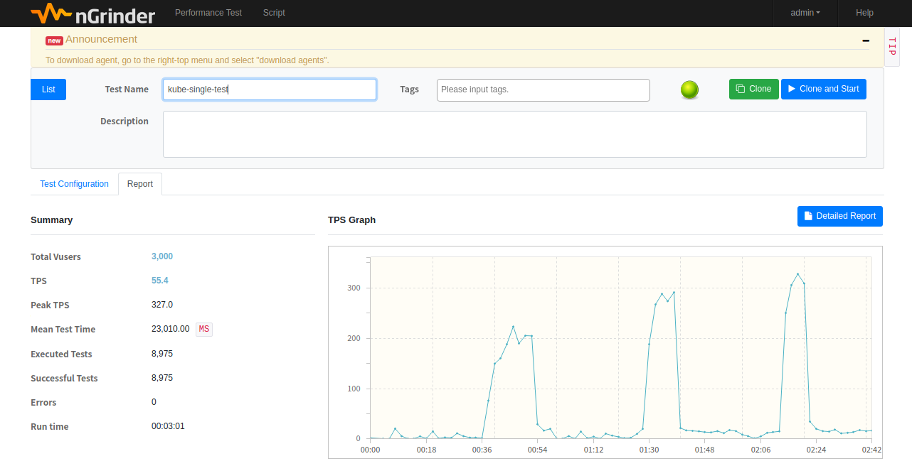

---
`서버 2개`


---
`서버 3개`
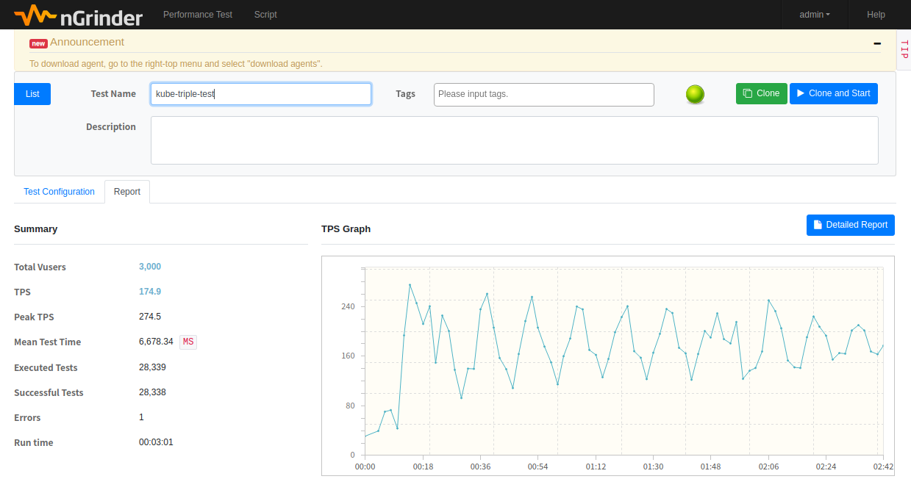  

---
`서버 4개`
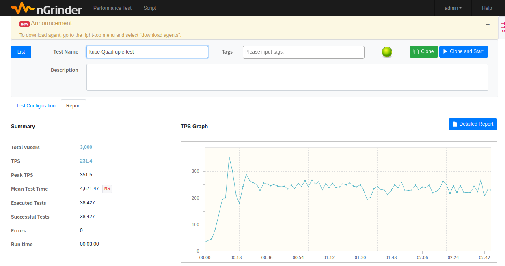
</details>

<details>
<summary><strong>모니터링(Grafana + Prometheus)</strong></summary>

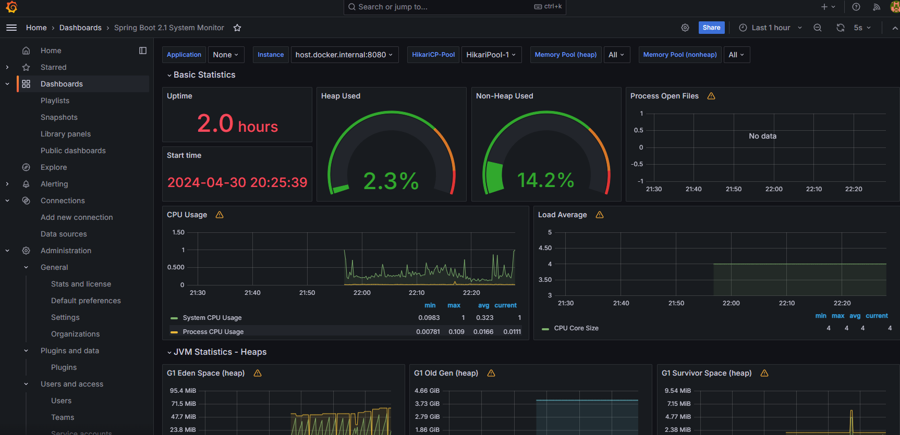

모니터링 데이터를 수집하고 저장하여 시각화하였다.  
(CPU 사용률, 메모리 사용률, HTTP 트래픽 감시 등등)
</details>


##  📍 주요 기능

<p style="font-size: 20px">Life Cycle</p>

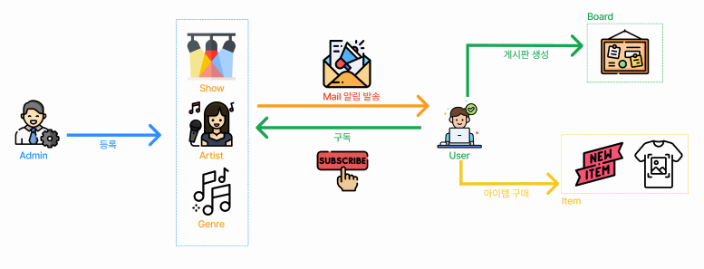

`관리자`
- 공연, 아티스트, 장르를 등록 및 관리를 한다.

`사용자`
- 사용자는 자신이 좋아하는 아티스트와 장르를 구독한다.  
- 구독한 아티스트 또는 장르를 포함하는 공연이 열리면 사용자에게 메일 발송으로 알림이 간다.
- 공연에 관한 좋아요 및 댓글을 작성할 수 있다.
- 게시판(공연 후기, 아티스트, 자유, 동행)을 자유롭게 작성 및 댓글을 달 수 있다.

---

<p style="font-size: 20px">Unlogin User</p>

1. 아티스트 조회 & 검색을 할 수 있다.
2. 공연 정보 캘린더 & 공연 정보를 확인할 수 있다.
3. 게시글을 볼 수 있다.
4. 공연 아이템을 조회할 수 있다.

---

<p style="font-size: 20px">Login User</p>

1. 회원가입, 로그인
   - 자체 회원가입 또는 소셜 로그인 **(네이버, 카카오)** 을 할 수 있다.
   - 로그인 **(Spring Security, JSON Web Token)**
   - 회원가입 시, 아이디 중복 확인 및 이메일 인증을 한다. **(Redis, Jakarta Mail)**
   - 이메일 인증을 통해 아이디를 찾을 수 있다. **(Redis, Jakarta Mail)**
   - 이메일 인증을 통해 임시 비밀번호를 발급받을 수 있다. **(Redis, Jakarta Mail)**
   - 비밀번호를 변경할 수 있다.
   - 회원 정보 조회 및 수정을 할 수 있다.
   - 로그아웃과 회원탈퇴를 할 수 있다.
   

2. 아티스트
   - 아티스트에 관한 정보들을 검색 및 조회할 수 있다.
   - 아티스트에 대한 좋아요와 구독을 할 수 있다.
   - 아티스트에 관한 공연 정보 생성 시, 이메일을 통해 알림을 받을 수 있다. **(Jakarta Mail)**


3. 공연
   - 공연을 검색 및 조회할 수 있다.
   - 공연에 대한 댓글 작성, 좋아요와 구독을 할 수 있다.


4. 장르
   - 장르에 관한 구독을 할 수 있다.
   - 구독한 장르를 포함한 공연 개설 시, 이메일 알림을 받을 수 있다. **(Jakarta Mail)**


5. 게시판
   - 카테고리별(공연 후기, 아티스트, 자유, 동행) 게시판에 대해 CRUD를 할 수 있다. (이미지 업로드 - AWS S3)
   - 각 게시물에 대해 댓글과 대댓글을 작성할 수 있다. (depth는 최대 1까지다.)
   - 작성일 순, 조회수 순으로 게시글들을 확인할 수 있다.
   - 제목, 내용 검색으로 게시글을 조회할 수 있다.


6. 아이템 & 주문 **(Toss API)**
   - 공연별 아이템을 조회할 수 있다.
   - 공연에 관한 아이템을 주문 및 결제할 수 있다.
   - 주문 조회 및 주문 취소를 할 수 있다.
---

<p style="font-size: 20px">Admin</p>

1. 관리자는 이메일 알림을 보낼 수 있다.


2. 회원관리
   - 관리자는 모든 회원을 조회할 수 있다.
   - 관리자는 회원 계정을 탈퇴시킬 수 있다.


3. 아티스트
   - 관리자는 아티스트 CRUD를 할 수 있으며, 검색, 조회를 할 수 있다. **(이미지 업로드 - AWS S3)**
   - 아티스트 추가 시, 아티스트명을 중복 체크하여 생성한다.


4. 공연
   - 공연에 관한 CRUD를 할 수 있다. **(이미지 업로드 - AWS S3)**


5. 장르
   - 장르 CRUD를 할 수 있다.


6. 게시판
   - 게시판 CRUD를 할 수 있다. 


7. 아이템 & 주문 **(Toss API)**
   - 아이템에 대한 CRUD를 할 수 있다.
   - 주문 조회 및 취소할 수 있다.
---

<div align="center">

##  👩🏻‍💻🧑🏻‍💻 참여자

| <br/>BE 강유신 <a href="https://github.com/simidot">GitHub</a> | <br/>BE 권혁건 <a href="https://github.com/KwonHyeokGeon">GitHub</a> | <br/>BE 어민규 <a href="https://github.com/fish-minkyu">GitHub</a> | <br/>BE 이강선 <a href="https://github.com/joshiaLee">GitHub</a> |
|:-------------------------------------------------------------------------------------------------------------------------------------------------------------------------------------------------:|:-------------------------------------------------------------------------------------------------------------------------------------------------------------------------------------------------------:|:-----------------------------------------------------------------------------------------------------------------------------------------------------------------------------------------------------:|:---------------------------------------------------------------------------------------------------------------------------------------------------------------------------------------------------:|
|                                <strong>1차 팀장</strong> <br> &middot; 장르 CRUD <br> &middot; 아티스트CRUD <br> &middot; 프론트 <br> &middot; Amazon S3 <br> &middot; 이메일 알림                                 |                                       <strong>팀원</strong> <br> &middot;공연 CRUD <br> &middot; 프론트 <br> &middot; AWS CI/CD <br> &middot; Grafana & Prometheus 모니터링                                        |                                            <strong>팀원</strong> <br> &middot; 게시글 CRUD <br> &middot; 프론트 <br> &middot; nGrinder 부하 테스트 <br> &middot; NCP 배포                                            |                     <strong>2차 팀장</strong> <br> &middot; 회원가입 & 로그인 <br> &middot; 프론트 <br> &middot; Toss API <br> &middot; 이메일 인증 <br> &middot; 크롤링 <br> &middot; Kubernetes 배포                     |

</div>


##  ⚠️ 대표 트러블 슈팅

<details>
<summary><strong>알림 서비스 구현하기</strong></summary>


# 1. 알림 서비스 구현하기

### 🖥️ 상황

- 사용자는 아티스트와 장르에 대해 구독할 수 있다.
- 새로운 공연 정보가 업로드될 때 사용자가 구독한 아티스트가 참여하거나, 사용자가 구독한 장르의 공연이라면 사용자에게 이메일로 알림을 보낸다.
- 이때, 이메일 알림은 **Jakarta Mail**로 메일 발송 처리를 하는데, 공연 정보를 업로드하는 메서드 내부에 구현해야할지? 구체적으로 어떤 방식으로 구현해야 할지 고민이 되었다.

### 🖋️ 알림 처리에 대한 공부

**1) Spring 비동기 처리 기능**


: 알림 작업을 비동기적으로 처리하여 응답 시간을 최소화할 수 있다.

- @EnableAsync + @Async : 단순한 스레드를 만들어준다.
- SpringAsyncConfig(@EnableAsync) + @Async(”threadPoolName”) : 스레드 풀을 만든다.
- 리턴 값이 있는 경우 : Future, ListenableFuture, CompleatableFuture 사용
- 👍🏻 : 높은 응답성, 자원 효율성 (필요에 따라 스레드 생성 및 관리)
- 👎🏻 : 코드 복잡도, 메모리 문제 (스레드가 다른 스레드와 동일한 메모리 공간을 공유한다)

**2) 이벤트 기반 아키텍처**


: 공연 정보가 업로드되는 이벤트를 발생시키고, 해당 이벤트를 구독하는 알림 서비스가 감지하여 알림을 보낸다.

- Spring의 이벤트 프레임워크 사용 + 이를 처리하는 리스너 등록
- 이벤트 발행 : ApplicationEventPublisher 주입받아 사용
- 이벤트 구독 : ApplicationListener 인터페이스 구현 혹은 @EventListener 사용
- 멀티 캐스팅 관계 : 다수의 수신자가 존재할 수 있는 통신 형태
- 동기 방식으로 동작 (트랜잭션이 하나의 범위로 묶일 수 있다.)
- 비동기 방식으로 하기 위해서는 별도의 설정이 필요
   - @Async 메서드로 비동기 구현
   - ApplicationEventMulticaster로 비동기 구현
- 👍🏻 : 의존성 분리, 재사용성, 별도의 서비스 분리 용이 (여러 도메인에서 사용 가능), 단위 테스트 용이
- 👎🏻 : 전반적인 작업량이 많아짐. 메시지 구독 순서를 고려해야 하는 경우 복잡.

**3) 알림 대기열**


: 메시지 큐나 대기열 시스템을 사용하여 알림 메시지를 임시 저장하고, 대기열을 정기적으로 확인하여 알림을 발송하는 방식.

- RabbitMQ 사용 (AMQP(Advanced Message Queuing Protocol)을 구현한 오픈 소스 메시지 브로커)
- Amazon SQS (Simple Queue Service) 사용
- Apache Kafka 사용 (고성능, 분산형 스트리밍 플랫폼. 대량의 데이터 스트리밍 처리에 특화)
- RabbitMQ 사용 (AMQP(Advanced Message Queuing Protocol)을 구현한 오픈 소스 메시지 브로커)
- ActiveMQ 사용
- 👍🏻 : 확장성, 결합도 감소, 부하 분산
- 👎🏻 : 복잡성 증가, 디버깅과 모니터링의 어려움

### **🌟 선택**

- 2번과 3번은 현재 상황에서 시간적 여유 및 경험 부족으로 구현이 어려울 것으로 예상.
- 그러나, 비동기 처리는 필수이므로 1번 방법을 활용해 알림 처리를 비동기로 처리하기로 했다.
- 핵심 : 알림 처리가 지연되어도 공연 정보 업로드 요청은 완료되어야 하며, 다른 스레드에서 알림을 처리할 수 있도록 비동기로 처리하여야 한다.

### 📨 구현

**1) AsyncConfig 설정**

- @EnableAsync : 비동기 기능 활성
- TaskExecutor를 사용하여 비동기 작업을 스케줄링 (ThreadPoolTaskExecutor)
- setCorePoolSize(n) : 기본적으로 실행 대기 중인 스레드 개수
- setMaxPoolSize(n) : 동시에 동작하는 최대 스레드 개수
- setQueueCapacity(n) : CorePool의 크기를 넘어서면 큐에 저장하는데, 그 큐의 최대 용량

```java
@Configuration
@EnableAsync // 스프링의 비동기 기능을 활성화하여 Async 어노테이션을 감지
public class AsyncConfig implements AsyncConfigurer {

  @Override
  @Bean(name = "threadPoolTaskExecutor")
  public Executor getAsyncExecutor() {
		// 내 PC의 Processor 개수를 가져옴.
    int processors = Runtime.getRuntime().availableProcessors(); 
	  // TaskExecutor를 사용하여 비동기 작업을 스케줄링 (ThreadPoolTaskExecutor)
    ThreadPoolTaskExecutor executor = new ThreadPoolTaskExecutor(); 
    // 기본적으로 실행 대기 중인 스레드 개수
    executor.setCorePoolSize(processors);
    // 동시에 동작하는 최대 스레드 개수
    executor.setMaxPoolSize(processors * 2); 
    // CorePool의 크기를 넘어서면 큐에 저장하는데, 그 큐의 최대 용량
    executor.setQueueCapacity(50); // 대기를 위한 Queue 크기
    executor.setKeepAliveSeconds(60);  // 스레드 재사용 시간
    executor.setThreadNamePrefix("AsyncExecutor-"); // 스레드 이름 prefix
    executor.initialize(); // ThreadPoolExecutor 생성

    return executor;
  }
}
```

**2) 비동기 적용**


: 비동기 처리 메서드에 @Async 어노테이션 붙여주기

```java
    // 이메일 발송 메서드
    @Override
    @Async("threadPoolTaskExecutor")
    @Transactional
    public void sendMail(Alert alert) throws MessagingException {
        log.info("===== email sending start");

        MimeMessage message = mailSender.createMimeMessage();
        MimeMessageHelper helper = new MimeMessageHelper(message, true, "UTF-8");

        helper.setSubject(EMAIL_TITLE_PREFIX + alert.getTitle()); //제목
        helper.setFrom("stage alarm <noreply@stagealarm.com>");
        helper.setTo(alert.getUserEmail());
        HashMap<String, String> emailValues = new HashMap<>();
        emailValues.put("content", alert.getMessage());
        String text = setContext(emailValues);
        helper.setText(text, true);
        helper.addInline("logo", new ClassPathResource("static/images/logo.png"));
        helper.addInline("notice-icon", new ClassPathResource("static/images/image-1.png"));

        mailSender.send(message);
        log.info("===== email sending end");
    }

```

```java
    // 공연 정보에 대한 알림 객체 생성 메서드 (내부에서 이메일 발송 메서드를 호출하므로 트랜잭션 처리를 했다)
    @Override
    @Async("threadPoolTaskExecutor")
    @Transactional
    public void createAlert(Long showInfoId) {
        // 해당 공연정보에서 아티스트 관련 알림 객체 생성
        log.info("===== artist alert creation start");
        List<ShowArtist> showArtists = showArtistRepo.findByShowInfoId(showInfoId);
        generateArtistSubAlert(showArtists);
        log.info("===== artist alert creation end");

        log.info("===== genre alert creation start");
        List<ShowGenre> showGenres = showGenreRepo.findByShowInfoId(showInfoId);
        generateGenreSubAlert(showGenres);
        log.info("===== genre alert creation end");

        List<Alert> alerts = alertRepository.findByShowInfoId(showInfoId);
        for (Alert alert : alerts) {
            try {
                log.info("send email start");
                alert.setMessage(generateMessage(alert, alert.getUserNickname()));
                sendMail(alert);
            } catch (MessagingException e) {
                log.warn(e.getMessage());
                throw new ResponseStatusException(HttpStatus.INTERNAL_SERVER_ERROR);
            }
        }
    }
```

**** 주의사항 ****

- @Async 어노테이션이 붙은 메서드는 같은 클래스 내에서 다른 메서드가 직접 호출할 경우 비동기로 실행되지 않는다. 스프링의 **프록시 기반 AOP**가 작동하는 방식 때문이다. 이를 해결하기 위해서는 자기 자신의 프록시 객체를 주입받아 사용하거나, 다른 빈에서 해당 메서드를 호출해야 한다.
- 비동기 메서드에서 발생하는 예외를 처리하기 위해서는 AsyncUncaughtExceptionHandler를 구현해야 한다.

### 🔥 트러블 발생


- 찾아봤더니 스프링은 프록시를 사용해서 별도의 스레드에서 Async 처리된 메서드를 실행할 때 프록시 기술을 사용한다고 한다. 음... 프록시가 뭔데 대체!....
- 프록시 생성 방법에는 JDK 동적 프록시 / CGLib 사용 가능
- 스프링 부트 사용시에는 AOP 적용시 기본으로 CGLib 사용
- @EnableAsync는 스프링부트의 방식과는 무관하게 **JDK 동적 프록시나 CGLib** 중 선택 가능하다. (기본값이 Jdk 동적 프록시)

<details>
<summary><strong>AOP Proxy 관련 간단 설명</strong></summary>

**1. JDK dynamic proxy**


:인터페이스 기반의 프록시 생성 방식. Java의 리플렉션을 이용해서 객체를 만든다.

대상의 객체가 최소 하나의 인터페이스를 구현했다면 JDK 프록시를 사용한다.

스프링은 JDK의 Proxy클래스를 사용하여 해당 인터페이스를 구현하는 프록시 객체를 동적으로 생성.

인터페이스를 통한 프록싱에 적합하다.

**2. CGLib proxy (Code Generation Library)**


: 클래스 기반의 프록시 생성 방식. 바이트코드를 조작해 프록시 객체를 만든다.  
대상 객체가 인터페이스를 구현하지 않거나, proxyTargetClass=true 설정을 사용하는 경우에 적용된다.  
상속을 사용하여 대상 클래스의 하위 클래스를 동적으로 생성하고, 이를 통해 프록시 객체를 만든다.  
클래스를 직접 상속하여 프록싱한다.

**default** : JDK dynamic proxy

만약 **@EnableAsync(proxyTargetClass =true)** 설정을 하였으면 **CGLib** proxy 강제

</details>


🤔사실 프록시에 대해 제대로 공부하지 않고, 그냥 어찌저찌 해결하다보니 실행이 되었다.  
이때 해결책으로 썼던 것은 **@EnableAsync(proxyTargetClass=true)**로 바꾸고, 된다! 하고 아무 생각 없이 넘겼다.  
하지만, 지금 트러블 슈팅을 적으며 프록시에 대해서 어느정도 개념을 공부하니, 얼떨결에~ 해결했다는 사실을 알게 되었다.  

위의 오류 상황을 제대로 살펴보면 Action에 두가지 해결책을 제시해주었다.

1) Consider injecting the bean as one of its interfaces

or

2) forcing the use of CGLib-based proxies by setting proxyTargetClass=true on @EnableAsync and/or @EnableCaching.

이렇게 두가지 방법이 있다.

1) 인터페이스 상속을 통해서 빈 주입을 하여 JDK dynamic proxy로 제대로 생성되게 만든다.

2) proxyTargetClass=true 설정을 통해서 CGLib proxy로 강제하여 생성되게 만든다.

위의 상황에서 나는 분명 interface를 구현하고 상속받았는데 왜 why? 이런 문제가 나는걸까 ? 했는데,  
알고보니, Async 어노테이션이 달리는 메서드가 꼭 반드시 인터페이스에 구현되어있어야 한다. = 인터페이스로 빈을 주입한다.   
그래서 두가지 메서드를 인터페이스 메서드로 구현하여 오버라이딩하여 구체적인 메서드를 구현해주었다.

```java
public interface AlertService {
    void createAlert(Long showInfoId);
    void sendMail(Alert alert) throws MessagingException;
}
```

```java
@Slf4j
@Service
@RequiredArgsConstructor
public class EmailAlertService implements AlertService {
    private final JavaMailSender mailSender;
    private final SpringTemplateEngine templateEngine;

    private final AlertRepository alertRepository;
    private final ShowArtistRepo showArtistRepo;
    private final ShowGenreRepo showGenreRepo;
    private final GenreSubscribeRepo genreSubscribeRepo;
    private final ArtistSubscribeRepo artistSubscribeRepo;

    private static final String EMAIL_TITLE_PREFIX = "[STAGE ALARM] 알림 : 새 공연이 등록되었습니다";
    private static final String EMAIL_ALARM_TITLE = "알림 : 새 공연이 등록되었습니다";

    @Override
    @Async("threadPoolTaskExecutor")
    public void sendMail(Alert alert) throws MessagingException {
        log.info("===== email sending start");

        MimeMessage message = mailSender.createMimeMessage();
        MimeMessageHelper helper = new MimeMessageHelper(message, true, "UTF-8");

        helper.setSubject(EMAIL_TITLE_PREFIX + alert.getTitle()); //제목
        helper.setFrom("stage alarm <noreply@stagealarm.com>");
        helper.setTo(alert.getUserEmail());
        HashMap<String, String> emailValues = new HashMap<>();
        emailValues.put("content", alert.getMessage());
        String text = setContext(emailValues);
        helper.setText(text, true);
        helper.addInline("logo", new ClassPathResource("static/images/logo.png"));
        helper.addInline("notice-icon", new ClassPathResource("static/images/image-1.png"));

        mailSender.send(message);
        log.info("===== email sending end");
    }

    @Override
    public void createAlert(Long showInfoId) {
        // 해당 공연정보에서 아티스트 관련 알림 객체 생성
        log.info("===== artist alert creation start");
        List<ShowArtist> showArtists = showArtistRepo.findByShowInfoId(showInfoId);
        generateArtistSubAlert(showArtists);
        log.info("===== artist alert creation end");

        log.info("===== genre alert creation start");
        List<ShowGenre> showGenres = showGenreRepo.findByShowInfoId(showInfoId);
        generateGenreSubAlert(showGenres);
        log.info("===== genre alert creation end");

        List<Alert> alerts = alertRepository.findByShowInfoId(showInfoId);
        for (Alert alert : alerts) {
            try {
                log.info("send email start");
                alert.setMessage(generateMessage(alert, alert.getUserNickname()));
                sendMail(alert);
            } catch (MessagingException e) {
                log.warn(e.getMessage());
                throw new ResponseStatusException(HttpStatus.INTERNAL_SERVER_ERROR);
            }
        }
    }

    private void generateArtistSubAlert(List<ShowArtist> shows) {
        for (ShowArtist artist : shows) {
            List<ArtistSubscribe> subscribes = artistSubscribeRepo.findByArtistId(artist.getArtist().getId());
            for(ArtistSubscribe subscribe : subscribes) {
                log.info("subscribe :: "+subscribe.toString());
                Alert alert = Alert.builder()
                    .showInfo(artist.getShowInfo())
                    .userEmail(subscribe.getUserEntity().getEmail())
                    .userNickname(subscribe.getUserEntity().getNickname())
                    .artistSubscribe(subscribe)
                    .title(EMAIL_ALARM_TITLE)
                    .build();

                alert = alertRepository.save(alert);
                log.info("saved..artist alert : "+alert.toString());
            }
        }
    }

    private void generateGenreSubAlert(List<ShowGenre> shows) {
        for (ShowGenre genre : shows) {
            List<GenreSubscribe> subscribes = genreSubscribeRepo.findByGenreId(genre.getGenre().getId());
            for (GenreSubscribe subscribe : subscribes) {
                String userEmail = subscribe.getUserEntity().getEmail();
                Optional<Alert> alertOptional = alertRepository.findByUserEmailAndShowInfoId(userEmail, genre.getShowInfo().getId());
                Alert alert;
                // 이미 해당 구독자 유저에 대한 알림이 생성된 상태이면 이미 생성된 alert에 추가만 하고 알림 이메일은 보내지 않음
                if (alertOptional.isPresent()) {
                    alert = alertOptional.get();
                    alert.setGenreSubscribe(subscribe);
                    alertRepository.save(alert);
                    log.info("==== set same alert for " + subscribe.getUserEntity().getNickname());
                    continue;
                } else { // 한 유저에 대한 알림이 생성되지 않은 상태이면 새로 생성
                    alert = Alert.builder()
                        .showInfo(genre.getShowInfo())
                        .genreSubscribe(subscribe)
                        .title(EMAIL_ALARM_TITLE)
                        .userEmail(userEmail)
                        .userNickname(subscribe.getUserEntity().getNickname())
                        .build();
                    alertRepository.save(alert);
                }
                log.info("saved..genre alert : "+alert.toString());
            }
        }
    }

    private String generateMessage(Alert alert, String userNickname){
        StringBuffer sb = new StringBuffer();
        sb.append("안녕하세요. ").append(userNickname).append("님, 스테이지 알람에서 알림 드립니다.   \n");
        sb.append("구독하신 ");
        if (alert.getGenreSubscribe() != null && alert.getArtistSubscribe()!=null) {
            sb.append("아티스트 :: ").append(alert.getArtistSubscribe().getArtist().getName()).append("와 ");
            sb.append("장르 :: ").append(alert.getGenreSubscribe().getGenre().getName()).append("의 공연 정보가 등록되었습니다.  \n");
        } else if (alert.getGenreSubscribe() == null) {
            sb.append("아티스트 :: ").append(alert.getArtistSubscribe().getArtist().getName()).append("의 공연 정보가 등록되었습니다.  \n");
        } else {
            sb.append("장르 :: ").append(alert.getGenreSubscribe().getGenre().getName()).append("의 공연 정보가 등록되었습니다.  \n");
        }
        sb.append("해당 공연 보기 : ").append(alert.getShowInfo().getTicketVendor()).append(" \n\n");
        sb.append("저희 스테이지 알람을 사랑해주셔서 감사합니다. ");

        return sb.toString();
    }

    private String setContext(Map<String, String> emailValues) {
        Context context = new Context();
        emailValues.forEach(context::setVariable);
        return templateEngine.process("email/index.html", context);
    }
}
```

### **📨📨📨 결과 로그**


1) 공연 정보 업로드시 uploadIntoS3 하고,

2) 해당 공연 정보에 대해서 저장을 하고,

3) 이 생성된 ShowInfo 객체를 가지고 관련 ShowArtist, ShowGenre 객체를 생성해주고

4) 이를 활용해 구독자와 ShowArtist, ShowGenre 연결짓는 Alert 객체를 만들어주고

5) 이 만들어진 Alert를 바탕으로 이메일 알림을 발송한다. (이때 확인하고 중복되게 알림이 보내지지 않는다)

6) 그렇게 알림은 비동기적으로 차례로 처리가 되고 이후 스레드가 닫힌다.

### **🌟🌟동기 처리 방식 vs. 비동기 처리 방식 🌟🌟**

동기 처리와 비동기 처리의 차이를 느껴보고자 실험을 했다.  
5명의 구독자에게 이메일을 발송하였다.


1) 동기 처리 방식 : 공연정보 업로드 요청시 5명의 구독자에게 이메일을 모두 발송하는 시간까지 더해져 **15.37s 기록**

2) 비동기 처리 방식 : 공연정보 업로드 요청시 **439ms 기록**, 요청 보낸 후에 이메일 전송이 차례로 이루어지고, 이메일 전송이 이루어지는 사이에도 여러번 요청을 보낼 수 있다.

[알림 동기처리와 비동기처리](https://www.notion.so/4d6c075d3db94bb0a957c201b40fbd80?pvs=21) <<동영상

</details>

<details>
<summary><strong>게시글 상세정보 및 댓글을 get요청할 때 아래의 에러발생</strong></summary>

## 🎃게시글 상세정보 및 댓글을 get 요청 할 때 아래의 에러발생


- FetchType.LAZY로 연관관계를 매핑할 때 연관된 엔티티가 모두 로딩되지 않고 필요로 할 때 로딩함.
- 데이터베이스에서 로딩되지 않은 대신 프록시 객체를 생성하여 사용함.
- Dto객체를 JSON으로 변환하는 직렬화할 때 해당 객체의 모든 필드는 완전하게 초기화되어야함.
  그러나 프록시 객체로 로딩된 객체는 직렬화과정에서 실제로 초기화되지않음.
- Jackson이 JSON으로 변환하는 동안 프록시 객체의 필드를 접근하려 할 때 에러가 발생!


> showInfo와 userEntity가 lazyloading됨


## 해결방법

엔티티 대신 DTO를 사용하여 정보를 직렬화하면 된다.


- UserEntity를 사용하는 대신 UserResponseDto를 사용하여 showComments의 getUserEntity()를 사용하지 않음
   - DTO로 변환할 때 필요한 데이터만을 가져오기 때문에 프록시 객체의 모든 데이터를 로딩할 필요가 없어서 프록시객체의 초기화를 강제로 발생시키지 않음.

```java
@Getter
@Setter
@Builder
@ToString
@NoArgsConstructor
@AllArgsConstructor
public class UserResponseDto {
    // comments에 get요청이 왔을 때 user정보를 주기 위한 userDto(userEntity를 직접 넘기지 않기 위해)
    private String nickname;
    private Long userId;
    private String authorities;

    public static UserResponseDto fromEntity(UserEntity user) {
        if (user == null) return null;
        return UserResponseDto.builder()
                .nickname(user.getNickname())
                .userId(user.getId())
                .authorities(user.getAuthorities())
                .build();
    }
}

```

Rest API를 통해 응답받은 DTO를 JSON으로 직렬화하는 과정에서 생각치도 못했던 에러가 많이 발생했다.  Jackson이 프로퍼티를 직렬화 할 때 getter를 사용하여 값을 읽기 때문에 DTO에 @Getter 어노테이션을 붙여주지 않으면 에러가 발생하는 등 Rest API를 구성할 때 더 세부적으로 고민해야 할 요소들이 많이 있지만 프론트를 직접 구현해보지않으면 알기 어려웠던 만큼 Rest API로 구현해보길 잘한 것 같다.

</details>

<details>
<summary><strong>Board Entity - Image Entity 순환참조</strong></summary>


## 문제.

게시글 생성 시, 이미지와 함께 생성을 하게 되면 반환값이 자니치게 크고 긴 이상한 점을 발견했다.  
해당 문제는 Board와 Image가 서로 참조를 하면서 반환값 또한 서로 참조하는 결과값이 나와  
Stack Over Flow가 발생하는 것이었다.

Postman으로 테스트를 할 땐 게시글이 생성이 되었지만 웹 브라우저로 테스트를 하면 생성되지 않았다.

### 에러 코드.(Stack Over Flow)

```java
Ignoring exception, response committed already: org.springframework.http.converter.HttpMessageNotWritableException: Could not write JSON: Infinite recursion (StackOverflowError)
Resolved [org.springframework.http.converter.HttpMessageNotWritableException: Could not write JSON: Infinite recursion (StackOverflowError)]
```

### Board Entity

```java
import com.example.stagealarm.BaseEntity;
import com.example.stagealarm.image.entity.Image;
import com.example.stagealarm.user.entity.UserEntity;
import jakarta.persistence.*;
import lombok.*;

import java.util.ArrayList;
import java.util.List;

@Getter
@Builder
@Entity
@NoArgsConstructor
@AllArgsConstructor
public class Board  extends BaseEntity {
  @Column(nullable = false)
  @Setter
  private String title;
  @Setter
  private String content;
  @Enumerated(EnumType.STRING)
  @Setter
  private ActivateEnum activate; //todo: Enum 신고로 바뀌었을 경우를 대비하여
  @Setter
  private Long views;

  @ManyToOne(fetch = FetchType.LAZY)
  @Setter
  private Category category;

  @ManyToOne(fetch = FetchType.LAZY)
  private UserEntity userEntity;

  @OneToMany(cascade = CascadeType.ALL, fetch = FetchType.LAZY)
  private List<Image> imageList;

  @OneToMany(mappedBy = "board", fetch = FetchType.LAZY)
  private List<BoardComment> commentList = new ArrayList<>();

  public void addImage(Image image) {
    // 현재 Board 인스턴스에 Image 객체를 추가
    this.imageList.add(image);
    // Image 객체의 Board 참조를 현재 Board 인스턴스로 설정
    image.setBoard(this);
  }

  public static Board.BoardBuilder customBuilder() {
    return builder()
      .commentList(new ArrayList<>())
      .imageList(new ArrayList<>());
  }
}
```

### Image Entity

```java
import com.example.stagealarm.BaseEntity;
import com.example.stagealarm.board.entity.Board;
import jakarta.persistence.Column;
import jakarta.persistence.Entity;
import jakarta.persistence.FetchType;
import jakarta.persistence.ManyToOne;
import lombok.*;

@Getter
@Builder
@Entity
@NoArgsConstructor
@AllArgsConstructor
public class Image extends BaseEntity {
  @Column(nullable = false)
  private String imgUrl;

  @ManyToOne(fetch = FetchType.LAZY)
  @Setter
  private Board board;
}
```

### 반환값(Postman) - 525ms, 405.31KB

```java
{
    "id": 4,
    "title": "test",
    "content": "test",
    "activate": "ACTIVATE",
    "views": 0,
    "userId": 2,
    "loginId": "user",
    "categoryId": 1,
    "createdAt": "2024-04-03T20:04:02.1838",
    "imageList": [
        {
            "id": 3,
            "createdAt": "2024-04-03T20:04:02.179216",
            "imgUrl": "https://s3.ap-northeast-2.amazonaws.com/java-test-s3/boardImg/ded4a01c-7f27-40a9-b814-d3b556ec35b4.png",
            "board": {
                "id": 4,
                "createdAt": "2024-04-03T20:04:02.1838",
                "title": "test",
                "content": "test",
                "activate": "ACTIVATE",
                "views": 0,
                "category": {
                    "id": 1,
                    "category": "공연 후기"
                },
                "userEntity": {
                    "id": 2,
                    "createdAt": "2024-04-03T17:31:18.739",
                    "loginId": "user",
                    "password": "$2a$10$9vANwbo5MJFzY029Pe0KFea1njGXu8SmjiDusK9uLGIWqpm48r8I2",
                    "email": "hhhjs0133@naver.com",
                    "nickname": "일반 사용자1",
                    "gender": null,
                    "phone": null,
                    "profileImg": null,
                    "address": null,
                    "authorities": "ROLE_USER",
                    "likeList": [],
                    "genreSubscribeList": [],
                    "artistSubscribeList": []
                },
                "imageList": [
                    {
                        "id": 3,
                        "createdAt": "2024-04-03T20:04:02.179216",
                        "imgUrl": "https://s3.ap-northeast-2.amazonaws.com/java-test-s3/boardImg/ded4a01c-7f27-40a9-b814-d3b556ec35b4.png",
                        "board": {
                            "id": 4,
                            "createdAt": "2024-04-03T20:04:02.1838",
                            "title": "test",
                            "content": "test",
                            "activate": "ACTIVATE",
                            "views": 0,
                            "category": {
                                "id": 1,
                                "category": "공연 후기"
                            },
                            "userEntity": {
                                "id": 2,
                                "createdAt": "2024-04-03T17:31:18.739",
                                "loginId": "user",
                                "password": "$2a$10$9vANwbo5MJFzY029Pe0KFea1njGXu8SmjiDusK9uLGIWqpm48r8I2",
                                "email": "hhhjs0133@naver.com",
                                "nickname": "일반 사용자1",
                                "gender": null,
                                "phone": null,
                                "profileImg": null,
                                "address": null,
                                "authorities": "ROLE_USER",
                                "likeList": [],
                                "genreSubscribeList": [],
                                "artistSubscribeList": []
                            },
                            // ... 무한 반복 ...
```


## 해결.

`@JsonManagedReference`와 `@JsonBackReference` 을 사용해서 순환 참조를 해결했다.  
JPA 엔티티나 다른 객체 관계에서 순환 참조를 방지하기 위해 해당 어노테이션들을 사용한다.  
`@JsonManagedReference`은 순환참조의 “부모”쪽에, `@JsonBackReference`은 “자식”쪽에 붙여 사용한다.

### Board Entity

```java
import com.example.stagealarm.BaseEntity;
import com.example.stagealarm.image.entity.Image;
import com.example.stagealarm.user.entity.UserEntity;
import com.fasterxml.jackson.annotation.JsonManagedReference;
import jakarta.persistence.*;
import lombok.*;

import java.util.ArrayList;
import java.util.List;

@Getter
@Builder
@Entity
@NoArgsConstructor
@AllArgsConstructor
public class Board  extends BaseEntity {
  @Column(nullable = false)
  @Setter
  private String title;
  @Setter
  private String content;
  @Enumerated(EnumType.STRING)
  @Setter
  private ActivateEnum activate; //todo: Enum 신고로 바뀌었을 경우를 대비하여
  @Setter
  private Long views;

  @ManyToOne(fetch = FetchType.LAZY)
  @Setter
  private Category category;

  @ManyToOne(fetch = FetchType.LAZY)
  private UserEntity userEntity;

  @OneToMany(cascade = CascadeType.ALL, fetch = FetchType.LAZY)
	@JsonManagedReference
  private List<Image> imageList;

  @OneToMany(mappedBy = "board", fetch = FetchType.LAZY)
  private List<BoardComment> commentList = new ArrayList<>();

  public void addImage(Image image) {
    // 현재 Board 인스턴스에 Image 객체를 추가
    this.imageList.add(image);
    // Image 객체의 Board 참조를 현재 Board 인스턴스로 설정
    image.setBoard(this);
  }

  public static Board.BoardBuilder customBuilder() {
    return builder()
      .commentList(new ArrayList<>())
      .imageList(new ArrayList<>());
  }
}
```

### Image Entity

```java
import com.example.stagealarm.BaseEntity;
import com.example.stagealarm.board.entity.Board;
import com.fasterxml.jackson.annotation.JsonBackReference;
import jakarta.persistence.Column;
import jakarta.persistence.Entity;
import jakarta.persistence.FetchType;
import jakarta.persistence.ManyToOne;
import lombok.*;

@Getter
@Builder
@Entity
@NoArgsConstructor
@AllArgsConstructor
public class Image extends BaseEntity {
  @Column(nullable = false)
  private String imgUrl;

  @ManyToOne(fetch = FetchType.LAZY)
	@JsonBackReference
  @Setter
  private Board board;
}
```

### 반환값 1045ms, 938B
```java
{
    "id": 5,
    "title": "test",
    "content": "test",
    "activate": "ACTIVATE",
    "views": 0,
    "userId": 2,
    "loginId": "user",
    "categoryId": 1,
    "createdAt": "2024-04-03T20:13:46.114877",
    "imageList": [
        {
            "id": 5,
            "createdAt": "2024-04-03T20:13:46.100346",
            "imgUrl": "https://s3.ap-northeast-2.amazonaws.com/java-test-s3/boardImg/2d921929-4280-442d-ac49-9f43f7be44df.png"
        },
        {
            "id": 6,
            "createdAt": "2024-04-03T20:13:46.109876",
            "imgUrl": "https://s3.ap-northeast-2.amazonaws.com/java-test-s3/boardImg/2b6e8b43-54b4-434d-a610-3bdbda4a9d4e.png"
        }
    ],
    "commentList": []
}
```


</details>


<details>
<summary><strong>소셜로그인 시, 토큰을 안전하게 클라이언트에게 전송하기</strong></summary>

### 상황

- 소셜로그인할때 `OAuth2SuccessHandler` 까지 도달하고나서 토큰을 발급하는데 이 토큰을 어떻게 클라이언트에게 안전하게 보낼수 있을까?
- 소셜로그인 성공시에 토큰을 쿼리파라미터로 보낼수는 있지만 URL에 다 노출이 되기때문에 최소한 **Response Header**에 보내고 싶지만 사실 보안적인 수준에서는 쿼리 파라미터로 보내나 헤더로 보내나 바디로 보내나 토큰을 탈취하는것은 큰 차이가 없다고 한다.
- 따라서 더 보안을 강화하기 위해 다음과 같은 해결책들을 공부해 보았다.

### 해결을 위한 공부

- `SimpleUrlAuthenticatoinSuccessHandler` 를 상속할경우 특정 URL로 리다이렉트만 가능하기 때문에 토큰을 http 헤더나 바디에 포함시킬수가 없다. (리다이렉트시에 초기 헤더정보는 다음 요청으로 전달되지 않기 때문에)
- 크게 두가지 해결책이 있다는걸 알았는데 쿠키에 jwt 토큰을 포함시키거나 헤더에 포함시키는 방법이 있다.
- 첫번째 방법은 원래대로 `SimpleUrlAuthenticatoinSuccessHandler` 을 쓰되 리다이렉트시에 jwt 토큰을 쿠키에 넣어서 전달하는 방법이 있다.
- 두번째로 헤더에 포함시키고 싶다면 `SimpleUrlAuthenticatoinSuccessHandler` 가 아니라 `OAuth2AuthenticationSuccessHandler` 를 상속해서 여기서 헤더에 포함시키는 방법이 있다. 이번 프로젝트에서는 헤더에 bearer jwt 토큰을 포함시키는 방식으로 진행했기 때문에 여기까지 하더라도 현재 보안수준을 만족하지만 만약 **공격자가 네트워크를 통해 전송되는 데이터 패킷을 가로채거나 모니터링하는 데이터 스니핑(Data Sniffing)**을 ****한다면 토큰이 탈취 당할수도 있기때문에 더 욕심이 생겨 나중에 있을 보안의 확장성을 위해 좀 더 공부를 해보았다.
- 결국 쿠키나 헤더 모두 탈취당할 가능성이 있는데 쿠키를 사용하는 방법이 더 여러가지 보안을 강화할 수단이 있다는것을 알게돼서 소셜로그인시에 쿠키로 전달하는 방법을 택했다.
- 보안 강화를 위해쿠키에 Secure 플래그를 설정함으로써 HTTPS 프로토콜일 경우에만 쿠키를 전달하여 **중간자 공격(man-in-the-middle attack)**으로 쿠키 정보를 보호할 수 있다. (현재는 개발단계 프로젝트 임으로 이 설정을 true로 하더라도 http로 보내짐을 확인했다)
- 추가로 HttpOnly 플래그를 설정해서 `javascript` 에서는 쿠키에 접근하지 못하고 서버측에서만 접근할수 있게 설정할수있다. 이것을 설정해서 **공격자가 상대방의 브라우저에 스크립트가 실행되도록 해서 정보를 탈취하는 XSS(Cross Site Scripting)** 공격으로부터 쿠키를 안전하게 보호할수 있다. (지금은 편의를 위해 이설정을 false 하고 쿠키에 들어있는 데이터만 꺼내고 바로 삭제하도록 했다. 나중에 보안 조건이 강화되면 true로 바꿀수있다)

### 코드 구현(서버에서 클라이언트로 쿠키 전달)

```java
package com.example.stagealarm.oauth;

import com.example.stagealarm.jwt.JwtTokenUtils;
import com.example.stagealarm.user.dto.UserDto;
import com.example.stagealarm.user.service.UserService;
import jakarta.servlet.ServletException;
import jakarta.servlet.http.Cookie;
import jakarta.servlet.http.HttpServletRequest;
import jakarta.servlet.http.HttpServletResponse;
import lombok.RequiredArgsConstructor;
import lombok.extern.slf4j.Slf4j;
import org.springframework.security.core.Authentication;
import org.springframework.security.core.userdetails.UserDetails;
import org.springframework.security.crypto.password.PasswordEncoder;
import org.springframework.security.oauth2.core.user.OAuth2User;
import org.springframework.security.web.authentication.SimpleUrlAuthenticationSuccessHandler;
import org.springframework.stereotype.Component;

import java.io.IOException;
import java.util.Objects;

@Slf4j
@Component
@RequiredArgsConstructor
public class OAuth2SuccessHandler
        extends SimpleUrlAuthenticationSuccessHandler {
    // JWT 발급을 위해 JwtTokenUtils
    private final JwtTokenUtils tokenUtils;
    // 사용자 정보 등록을 위해 UserService
    private final UserService userService;
    private final PasswordEncoder passwordEncoder;

    @Override
    public void onAuthenticationSuccess(
            HttpServletRequest request,
            HttpServletResponse response,
            Authentication authentication
    ) throws IOException, ServletException {
        // OAuth2UserServiceImpl의 반환값이 할당된다.
        OAuth2User oAuth2User
                = (OAuth2User) authentication.getPrincipal();

        // 넘겨받은 정보를 바탕으로 사용자 정보를 준비
        String email = oAuth2User.getAttribute("email");
        String provider = oAuth2User.getAttribute("provider");
        String username
                = String.format("%s:%s", provider, email);
        String providerId = oAuth2User.getAttribute("id").toString();
        String nickname = oAuth2User.getAttribute("nickname");

        // 이메일 중복 검사
        if (userService.existsByEmail(email)) {
            // 중복된 이메일이 있을 경우, 과거에 가입한 sns 가 아닐시 중복 알림 페이지로 리다이렉트
            String sns= userService.searchByEmail(email).getLoginId().split(":")[0];
            if(!Objects.equals(provider, sns)){
                String duplicateEmailPage = "http://localhost:8080/user/emailDuplicate";
                getRedirectStrategy().sendRedirect(request, response, duplicateEmailPage);
                return;
            }
        }

        // 처음으로 이 소셜 로그인으로 로그인을 시도했다.
        if (!userService.userExists(username)) {
            // 새 계정을 만들어야 한다.
            userService.joinWithoutFile(UserDto.builder()
                    .loginId(username)
                    .email(email)
                    .nickname(nickname)
                    .password(passwordEncoder.encode(providerId))
                    .build());

        }
        log.info(username);

        // 데이터베이스에서 사용자 계정 회수
        UserDetails details
                = userService.loadUserByUsername(username);
        // JWT 생성
        String jwt = tokenUtils.generateToken(details);

        // 쿠키에 JWT 토큰 저장
        Cookie jwtCookie = new Cookie("auth_token", jwt); // "auth_token"은 쿠키의 이름입니다.

        // 쿠키 설정 (옵션)
        jwtCookie.setHttpOnly(false); // JavaScript를 통한 접근 방지 false -> 프론트에서 바로 꺼내고 지울용도임
        jwtCookie.setSecure(true); // HTTPS 를 통해서만 쿠키를 전송
        jwtCookie.setPath("/"); // 사이트 전역에서 쿠키 접근 가능

        // 응답에 쿠키 추가
        response.addCookie(jwtCookie);
        // oauthClient 는 JWT 를 처리할 클라이언트측 페이지를 연결해줌
        String redirectUrl = "http://localhost:8080/user/oauthClient";
        getRedirectStrategy().sendRedirect(request, response, redirectUrl);
        // 토큰을 -> 쿠키 -> 리다이렉트
    }
}

```

### 클라이언트에서 쿠키에있는 정보 추출


```jsx
document.addEventListener("DOMContentLoaded", function() {
        // 쿠키에서 특정 이름의 값을 가져오는 함수
        function getCookie(name) {
            let cookieValue = null;
            if (document.cookie && document.cookie !== '') {
                const cookies = document.cookie.split(';');
                for (let i = 0; i < cookies.length; i++) {
                    const cookie = cookies[i].trim();
                    // 쿠키의 이름을 찾으면 값을 반환
                    if (cookie.substring(0, name.length + 1) === (name + '=')) {
                        cookieValue = decodeURIComponent(cookie.substring(name.length + 1));
                        break;
                    }
                }
            }
            return cookieValue;
        }

        // 'auth_token' 쿠키의 값을 localStorage에 저장
        const jwtToken = getCookie('auth_token');
        if (jwtToken) {
            localStorage.setItem('jwtToken', jwtToken);
            console.log('JWT saved to localStorage');

            // 쿠키 삭제하기 위해 과거 시간 설정
            document.cookie = "auth_token=; expires=Thu, 01 Jan 1970 00:00:00 UTC; path=/;";
            // 필요한 로직 수행, 예: 홈페이지로 리다이렉션
            location.href = '/';
        } else {
            console.log('No JWT token found in cookies');
        }
    });
```

- 현재는 Bearer Token 방식으로 토큰을 추출하지만 나중에는 쿠키로부터 jwt토큰을 추출하는 방법으로 발전할수 있다.
- **이 방식을 쓸경우 보안은 강화되지만 클라이언트에서 쿠키 정보를 읽을수 없어서 필요한 개별 정보들을 각각 api로 요청해서 얻어야하기때문에 로직의 복잡성은 증가하게 된다.**
- 이번 프로젝트에서는 편의를 위해 주로 헤더에 토큰첨부하는 방식을 택했고 제한되는 상황에서만 쿠키를 도입했다. 나중에 보안 조건 수준이 높아졌을때를 대비해서 쿠키를 이용한 SpringSecurity Filter 코드를 아래에 작성했다.

### 쿠키 방식의 SpringSecurity(보안 강화 버전, 현재는 미적용 상태)

```java
public class JwtTokenFilter extends OncePerRequestFilter {
    @Override
    protected void doFilterInternal(HttpServletRequest request, HttpServletResponse response, FilterChain filterChain)
            throws ServletException, IOException {
        // 쿠키에서 JWT 토큰 추출
        String token = extractJwtFromCookie(request);
        // 토큰이 유효하다면
        if (token != null && jwtTokenUtils.validate(token)) {
            SecurityContext context = SecurityContextHolder.createEmptyContext();
                // 사용자 정보 회수
                Claims jwtClaims = jwtTokenUtils
                        .parseClaims(token);

                String loginId = jwtClaims.getSubject();
                String authorities = jwtClaims.get("roles", String.class);

                CustomUserDetails customUserDetails = CustomUserDetails.builder()
                        .loginId(loginId)
                        .authorities(authorities)
                        .build();

                // 인증 정보 생성
                AbstractAuthenticationToken authentication =
                        new UsernamePasswordAuthenticationToken(
                                customUserDetails,
                                token,
                                customUserDetails.getAuthorities()
                        );
                // 인증 정보 등록
                context.setAuthentication(authentication);
                SecurityContextHolder.setContext(context);
                log.info("set security context with jwt");

        }
        else {
                log.warn("jwt validation failed");
        }
        // 다음 필터 호출
        filterChain.doFilter(request, response);
    }

    private String extractJwtFromCookie(HttpServletRequest request) {
        Cookie[] cookies = request.getCookies();
        if (cookies != null) {
            for (Cookie cookie : cookies) {
                if ("JWT_COOKIE".equals(cookie.getName())) {
                    return cookie.getValue();
                }
            }
        }
        return null;
    }
}
```

### 기타 느낀점

- 토큰을 다루게 되면서 보안에 관심이 높아지고 어떨때 보안이 취약해지는지 고민할수 있는 시간을 가지게 되었고 나중에 있을 상황에 대한 대처능력을 기를수 있는 시간이였다.
- 토큰에대한 두가지 방법 모두 각각 트레이드오프가 있기때문에 요구조건을 이해하고 적절히 사용하는 역량을 기를수 있었다.
- 마지막으로 이렇게 쿠키을 활용하고 보니까 프론트와 백엔드가 완벽히 분리된 상황에서
  클라이언트가 필요한 정보들을 SpringMVC의 model을 통해서가 아닌 쿠키를 사용해서 전달할수  있음을 경험으로 알게 되었고 다른곳에도 활용할수 있었다.

</details>


## 📑 그 외 참고자료

[Notion 팀 페이지](https://www.notion.so/likelion/2-b4ae698de11c4901950888a6ee4e8276)  
[구글 Docs](https://docs.google.com/spreadsheets/d/1WacFNxTyaTTMJUTAr5o31jfDy5gTPPctyxTsqtqr4E4/edit#gid=1882734205)  
[Figma](https://www.figma.com/file/30qML24bA9FAcJKJfDpdWA/Untitled?type=design&node-id=0-1&mode=design&t=BBJQwYdkh4aKToZn-0)


