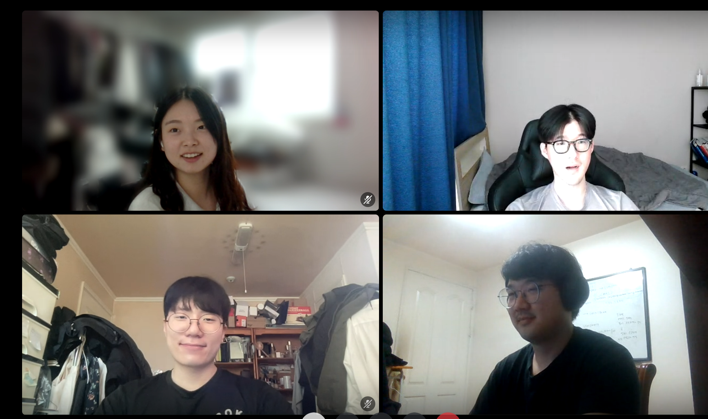

# [2주차] Project_2팀 진행상황 공유

## 팀 구성원, 개인 별 역할

---

- 강유신 : 팀회의 주도, 기능구현 및 PR Merge
- 권혁건 : 팀 회의 참석, 기능 구현
- 어민규: 팀 회의 참석, 기능 구현
- 이강선: 팀 회의 참석, 기능 구현

## 팀 내부 회의 진행 회차 및 일자

---

- 1회차(2024.03.18) 디스코드 음성채널로 진행 전원 참석
- 2회차(2024.03.19) 디스코드 음성채널로 진행 전원 참석
- 3회차(2024.03.20) 디스코드 음성채널로 진행 전원 참석
- 4회차(2024.03.21) 디스코드 음성채널로 진행 전원 참석
- 5회차(2024.03.22) 디스코드 음성채널로 진행 전원 참석

## 현재까지 개발 과정 요약 (최소 500자 이상)

---

**- 강유신** :

    - 기능별 목표 : 장르 CRUD, 아티스트-좋아요 기능, 장르-구독하기 기능, 아티스트-구독하기 기능, 구독시 알림 기능
    - 목표 달성률 : 장르 CRUD (백) 완료, 구독 화면 자체 내에서 아티스트/장르 구독과 아티스트-좋아요 기능 모두 구현해야 하는데, 화면 70% 그린 상태이고, 아티스트-좋아요 기능까지만 구현.
    - 성과자체 평가 :
        - 시큐리티에서 굳이 DB에 접근하지 않고도 구현이 가능한 방법이 있었다. 팀원들과 함께 대화해보며 서로 깨달음을 얻는 것이 좋았고, 프로젝트 기능 구현도 중요하지만, 이를 통해 모두가 얻어갈 수 있는 시간이었으면 좋겠다고 생각했다.
        - 또 팀원들과 소통의 오류로 구현 방향이 다르다는 것을 알게되어 약간 시간을 쏟았는데, 기술 개발에 들어가기 이전 기획 단계에서 아주 상세하게 대화를 나눠야 했었다고 생각했다. 프론트에 대한 명확한 프로토타입이 없어서 더욱 추상적인 대화밖에 못했던 것 같아서 역시나 기본적인 필수사항들에 집중해야 함을 느꼈다.
        - 프론트가 따로 없어서 완전히 백 파트에 집중하지 못한다는 점이 아쉽긴 하지만, 그래도 프론트의 구현 방법을 어느정도 배우게 되는 것도 의미있다고 생각하여 열심히 익혀보고 있다. 좋아요 기능 구현시 Redis를 활용하여 지연 저장되도록 하는 방법도 공부하여 구현해보고 싶다.
**- 권혁건 :**

    - 기능별 목표 : 공연정보 및 댓글 CRUD, 공연정보-좋아요 기능, 검색, 정렬, 캘린더 일정 표시 기능
    - 목표 달성률 : 공연정보 및 댓글 CRUD (백). 검색 및 정렬 완료
    - 성과자체 평가 :
        - 초기 기획을 더 꼼꼼히 하지 못한 것이 아쉬우며 프론트 구현에 있어 시간이 오래 걸릴 것으로 예상된다
        - rest api와 프론트 간의 통신에 대해 이해가 늘었고 백엔드구현이 쿼리문을 제외하면 너무 헤매지 않아서 다행이라고 생각한다.
**- 어민규:**

    - 기능별 목표: 게시판(공연 후기, 동행, 자유) CRUD, 댓글 & 대댓글 CRUD, 검색, 정렬
    - 목표 달성률: 게시판 검색 및 정렬 완료
    - 성과자체 평가: 대체적으로 개인에 대한 성과는 불만족, 예상 외의 곳에서 발생한 오류를 잡느라
      이미지 CRUD와 프론트를 그리지 못했다.
**- 이강선** :

    - 기능별 목표 : 아티스트 CRUD, UserEntity CRUD, 회원 가입, 소셜 로그인
    - 목표 달성률 : 백엔드와 프론트엔드 약 80% 완료. 전반적인 기능은 만들었지만 프론트나 테스트등에서 부실한점이 있음.
    - 성과자체 평가 :
        - 처음해보는 프론트 작업으로 인해 약간 헤메는 상황이 있었는데 오히려 그런 시간을 통해 구조적으로 어떻게 프론트와 백엔드가 분리돼야하는지 원리를 알수있게 되었고 직접 기초적인 프론트를 구현해 봄으로써 클라이언트와 서버의 http api 통신에 대해서 더 깊이 이해할수 있었던것 같다.
        - 하루에 한번 이상 소통을 하는게 도움이 많이 되었다. 팀원이 간단한 리뷰로 보고하는 시간이 있었는데 내 전담이 아닌 파트도 대략적인 이해를 하는데 도움이 되었고 내가 놓친 부분을 다시 고려하는 시간도 가짐으로써 프로젝트 최적화에 대해서 고민을 할수 있었고 그 과정에서 소프트 딜리트, 토큰의 저장 방법, 토큰 방식을 통해 스프링 시큐리티를 사용할때 DB에 접근하지 않는 방법등을 배울수가 있었다.
        - 처음부터 구체적으로 프론트는 어떻게 해야하는지 방식에 대해서는 소통이 부족했던게 아쉽다.

## 개발 과정에서 나왔던 질문 (최소 200자 이상)

---

1. 일반적인 로그인 방식은 Access Token과 Refresh Token을 어떻게 전달할까?
쿠키로 보내야할까? 보안을 위해 body로? 아니면 header로?

- Http 헤더와 바디의 의미를 다시 돌아봐야 한다.
- 결론부터 이야기하자면, 로그인 응답의 핵심적인 부분인만큼 body에 담아서 보내는 것이 옳게 보여진다.

- Http의 보안이 뜷리게 된다면 header와 body 모두 다 볼 수 있기 때문에 보안적인 측면에서
어떻게 보낼지 고민하는 것은 의미가 없다.

- 만약, 토큰 인증방식을 체택했다면 쿠키에 토큰을 넣어 사용하는 인증방법은 배제하는 것이 나은 것 같다.
원래 쿠키에 토큰을 넣는 것이 아니다.
어느순가부터 누군가 쿠키에 토큰을 넣어 응답한다고 한 방식이 인터넷에 널리 퍼지게 되었다.

2. 좋아요 버튼을 누르면 post요청으로 좋아요 insert문이 나가고, 이 요청이 반영된 좋아요 수가 바로 화면에 적용하고 싶을 때, 

- 1️⃣**POST** 요청과 함께 좋아요 개수 조회하는 **GET** 요청을 동시에 보낸다. 
- 2️⃣ **POST** 요청의 반환에 해당 요청이 반영된 좋아요 개수를 **반환**하도록 하여 요청을 1번만 보낸다. 중 어떤 방법을 택해야할까?
    
    - 2️⃣ 일단 1번만 요청을 보내는 방법을 선택했다. 그러나, 좋아요를 요청하는 사용자가 아주 많아진다면? 이를 어떻게 바로바로 처리할지도 고민해보았다.
    - 이런 경우에는 좋아요 요청을 한 이후 일정시간이 지났을 때에도 좋아요 요청 상태가 유지된 사용자만 실제로 쿼리문이 나가도록 Redis를 활용해 구현할 수도 있다. 이 부분은 시간이 난다면 구현하려고 한다.

3. 소셜로그인 성공시에 리다이렉트를 해야하는데 이때 토큰을 어떻게 프론트에 전달할까? 
- 쿼리파라미터로 보낼수는 있지만 URL에 다 노출이 되기때문에 최소한 http body에 보내고 싶지만 보안적인 수준에서는 쿼리 파라미터로 보내나 헤더로 보내나 바디로 보내나 토큰을 탈취하는것은 큰 차이가 없다고 한다. 
- 그래서 다음과 같은 솔루션을 생각해 보았고 질문할 예정이다.

  - 그냥 보안수준은 똑같으니 리다이렉트시  URL 쿼리파라미터에 토큰을 전달한다.
  - 소셜로그인 성공시 토큰을 세션이나 Redis에 저장하고 프론트는 토큰을 꺼내는 html로 리다이렉트 시킨다. (세션을 안쓰고 토큰방식을 썼는데 또 세션을 쓰는게 맞지않는것 같는 느낌이 든다.)
  - 토큰의 유효시간을 짧게 설정해서 탈취하더라도 쓸모가 없게 보안을 강화한다.

## 개발 결과물 공유

---

Github Repository URL: https://github.com/TECHIT-TEAM-i5/stage_alarm

